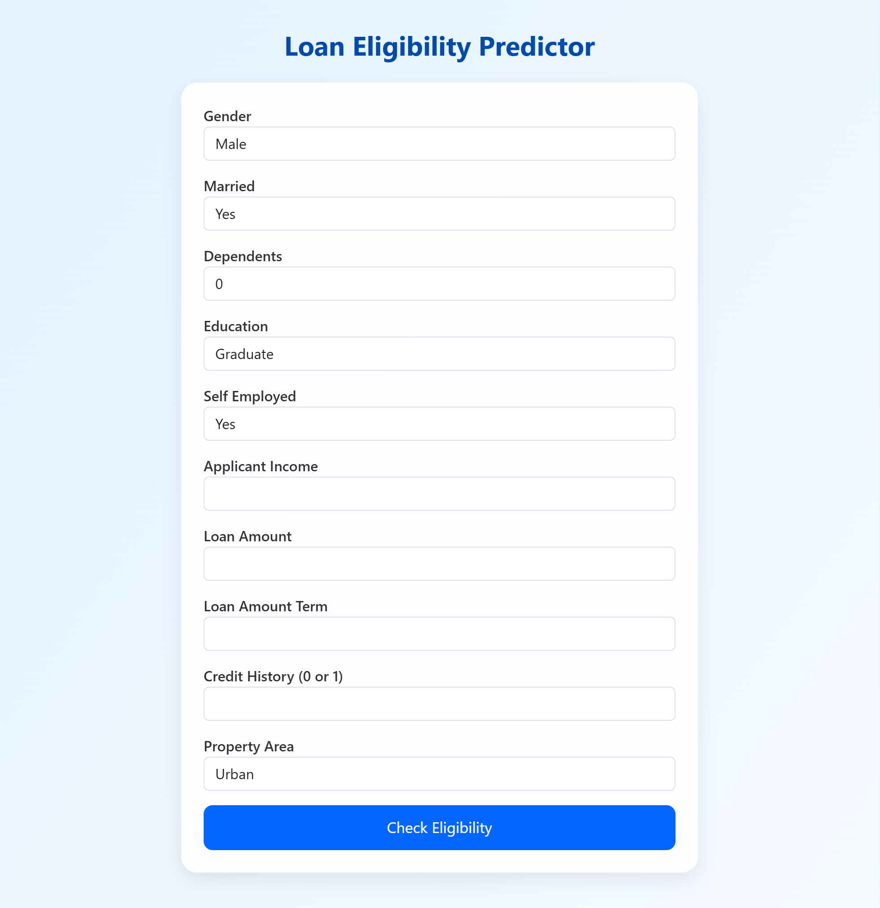
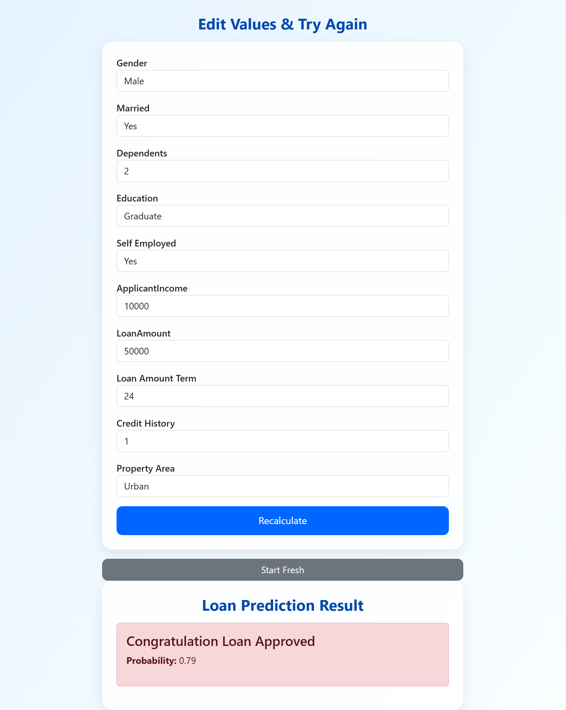

# Loan Approval Prediction App

A machine learning-powered web application that predicts loan approval eligibility based on applicant information. The project includes data preprocessing, model training with multiple algorithms, and a user-friendly Flask web interface.

## 🚀 Features

- **Data Preprocessing**: Comprehensive feature engineering including missing value imputation, categorical encoding, and numerical scaling
- **Machine Learning Models**: Trained with Logistic Regression and Random Forest algorithms
- **Web Application**: Interactive Flask app with Bootstrap-styled UI
- **Real-time Prediction**: Instant loan eligibility assessment with probability scores
- **User-Friendly Interface**: Clean form-based input with result visualization

## � Screenshots

### Application Interface

*The main loan application form where users input their information*

### Prediction Results

*Sample prediction results showing approval status and probability*

## �📊 Dataset

The application uses a loan dataset containing the following features:
- **Demographic Information**: Gender, Marital Status, Dependents, Education
- **Financial Details**: Applicant Income, Loan Amount, Loan Amount Term
- **Credit History**: Credit score and history
- **Property Information**: Property area (Urban/Semiurban/Rural)
- **Employment Status**: Self-employed indicator

## 🛠️ Technologies Used

- **Python** - Core programming language
- **Flask** - Web framework
- **Scikit-learn** - Machine learning library
- **Pandas & NumPy** - Data manipulation
- **Bootstrap** - Frontend styling
- **Jupyter Notebook** - Model development environment

## 📈 Model Performance

### Random Forest Classifier (Primary Model)
- **Accuracy**: ~78-82% (based on test evaluation)
- **Features**: 300 estimators, handles feature importance automatically
- **Pipeline**: Includes preprocessing steps for production-ready deployment

### Logistic Regression (Alternative Model)
- **Accuracy**: ~75-80% (based on test evaluation)
- **Features**: Max iterations set to 1000 for convergence
- **Pipeline**: Same preprocessing pipeline as Random Forest

## 🤔 Why Random Forest Over Logistic Regression?

After evaluating both algorithms on the loan approval dataset, **Random Forest was selected as the primary model** for the following reasons:

### Performance Advantages
- **Higher Accuracy**: Random Forest achieved better test accuracy (~78-82% vs ~75-80%)
- **Better Handling of Non-Linear Relationships**: Loan approval involves complex interactions between features like income, credit history, and property area that Random Forest captures more effectively
- **Feature Importance**: Automatically identifies and ranks important features, providing insights into what drives loan decisions

### Practical Benefits
- **Robustness**: Less sensitive to outliers and missing values compared to Logistic Regression
- **No Feature Scaling Required**: Tree-based algorithms like Random Forest don't require standardization of numerical features
- **Interpretability**: While Logistic Regression is more interpretable, Random Forest still provides feature importance scores
- **Production Ready**: Handles mixed data types (categorical and numerical) seamlessly in the pipeline

### When Logistic Regression Might Be Preferred
- If model interpretability is the top priority (coefficients show feature impact direction)
- For smaller datasets where overfitting is a major concern
- When computational resources are limited (faster training and prediction)

The final choice balances accuracy, robustness, and practical deployment considerations for a real-world loan approval system.

## 🔧 Installation

1. **Clone the repository**:
   ```bash
   git clone https://github.com/shahabahmad7/loan-approval-prediction-app.git
   cd loan-approval-prediction-app
   ```

2. **Create virtual environment**:
   ```bash
   python -m venv loanapp
   loanapp\Scripts\activate  # On Windows
   ```

3. **Install dependencies**:
   ```bash
   pip install -r requirements.txt
   ```

4. **Run the Jupyter notebook** (optional, for model training):
   ```bash
   jupyter notebook notebook/code.ipynb
   ```

5. **Run the Flask application**:
   ```bash
   python app.py
   ```

6. **Access the application**:
   Open your browser and navigate to `http://localhost:5000`

## 📝 Usage

1. **Access the Home Page**: Fill out the loan application form with applicant details
2. **Input Fields**:
   - Personal information (Gender, Marital Status, etc.)
   - Financial details (Income, Loan Amount, Term)
   - Credit history and property area
3. **Submit**: Click "Check Eligibility" to get instant prediction
4. **Results**: View approval status and probability score
5. **Modify & Retry**: Edit values and recalculate if needed

## 🏗️ Project Structure

```
loan-approval-prediction-app/
│
├── app.py                          # Flask web application
├── requirements.txt                # Python dependencies
├── Loan_Data.csv                   # Dataset (training data)
├── load_model.pkl                  # Trained Random Forest model
│
├── notebook/
│   └── code.ipynb                  # Jupyter notebook with ML pipeline
│
├── templates/
│   ├── frontend.html               # Main application form
│   └── result.html                 # Prediction results page
│
└── loanapp/                        # Virtual environment
    ├── Scripts/
    └── Lib/
```

## 🔍 Model Development Process

### 1. Data Exploration
- Loaded and analyzed the loan dataset
- Identified missing values and data types
- Performed initial data cleaning

### 2. Feature Engineering
- **Missing Value Imputation**:
  - Categorical features: Mode imputation
  - Numerical features: Median imputation
- **Data Cleaning**:
  - Converted '3+' dependents to integer 3
  - Mapped target variable to binary (0/1)
- **Feature Transformation**:
  - One-Hot Encoding for categorical variables
  - Standard Scaling for numerical features

### 3. Model Training
- **Pipeline Creation**: Combined preprocessing and model training
- **Algorithm Comparison**:
  - Logistic Regression: Simple, interpretable baseline
  - Random Forest: Ensemble method for better performance
- **Evaluation**: Accuracy, confusion matrix, classification report

### 4. Model Selection
- Random Forest selected for deployment due to better performance
- Model saved as pickle file for Flask app integration

## 🎯 Prediction Logic

The application uses a probability threshold of **0.6**:
- **Probability > 0.6**: "Congratulations! Loan Approved"
- **Probability ≤ 0.6**: "You are not Eligible"

This threshold can be adjusted based on business requirements for risk tolerance.


## 🙏 Acknowledgments

- Dataset source: Loan prediction dataset (commonly available on Kaggle)
- Inspired by real-world loan approval processes
- Built with open-source machine learning libraries

## 📞 Contact

For questions or feedback, please open an issue in the repository.

---

**Note**: This is a demonstration project for educational purposes. In real-world applications, loan approval decisions should involve comprehensive risk assessment, regulatory compliance, and human oversight.</content>
<parameter name="filePath">D:\ML_Projects\End-to-End Loan Approval-Prediciton-App\README.md